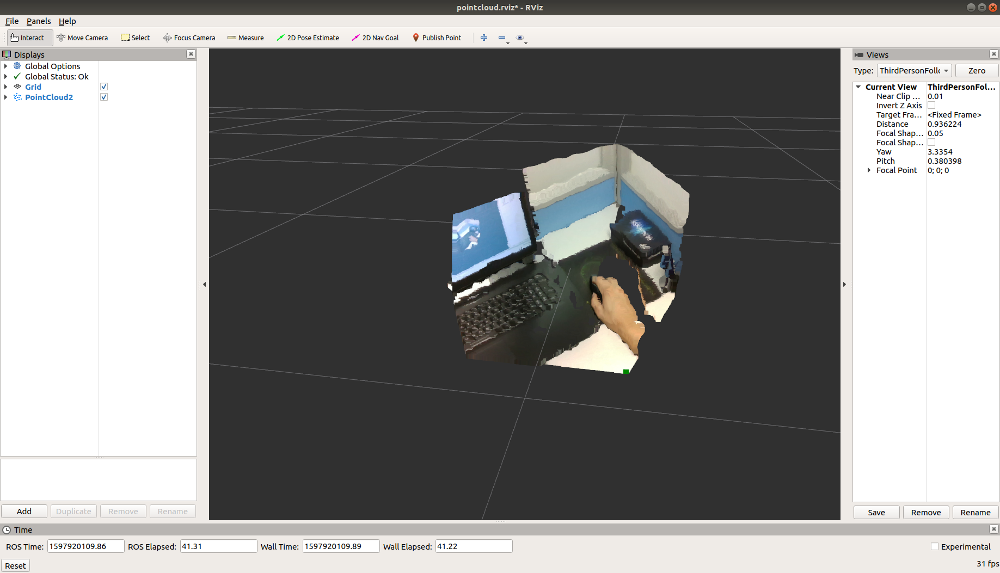

### Install the latest Intel® RealSense™ SDK 2.0

* Add Intel server to the list of repositories :

`echo 'deb http://realsense-hw-public.s3.amazonaws.com/Debian/apt-repo xenial main' | sudo tee /etc/apt/sources.list.d/realsense-public.list`

It is recommended to backup /etc/apt/sources.list.d/realsense-public.list file in case of an upgrade.
* Register the server’s public key :

`sudo apt-key adv --keyserver keys.gnupg.net --recv-key 6F3EFCDE`

* Refresh the list of repositories and packages available :

sudo apt-get update

* In order to run demos install:

`sudo apt-get install librealsense2-dkms`

`sudo apt-get install librealsense2-utils`

The above two lines will deploy librealsense2 udev rules, kernel drivers, runtime library and executable demos and tools. Reconnect the Intel RealSense depth camera and run: **realsense-viewer**

- Developers shall install additional packages:
  `sudo apt-get install librealsense2-dev`
  `sudo apt-get install librealsense2-dbg`
  With `dev` package installed, you can compile an application with **librealsense** using `g++ -std=c++11 filename.cpp -lrealsense2` or an IDE of your choice.
- Verify that the kernel is updated :
  `modinfo uvcvideo | grep "version:"` should include `realsense` string

### Install Intel® RealSense™ ROS from Sources
`git clone https://github.com/IntelRealSense/realsense-ros`

`catkin_make`

### get erro

If get error is basically the SDK version does not correspond to the ROS, you need to compile and install from the source code.

source code：https://github.com/IntelRealSense/librealsense/releases

Use cmake to compile and install.

or you need to install this：sudo apt-get install ros-melodic-ddynamic-reconfigure

* demo：

`roslaunch realsense2_camera demo_pointcloud.launch `

* 效果:

